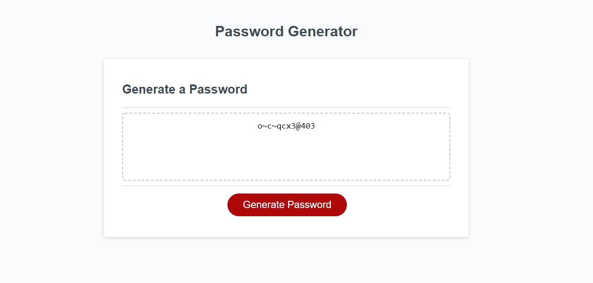

# passwordGenerator

## Create a randomly generated pasword for greater security.

### User makes a choice of 8-128 characters in length. User then chooses if they want to include upper and lowercase letters along with #'s and special characters. Password is randomly generated and displayed.

[link to deployed password generator site](https://findjules2.github.io/passwordGenerator/)

